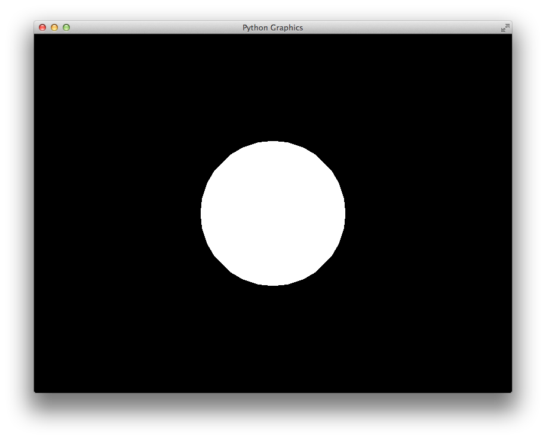
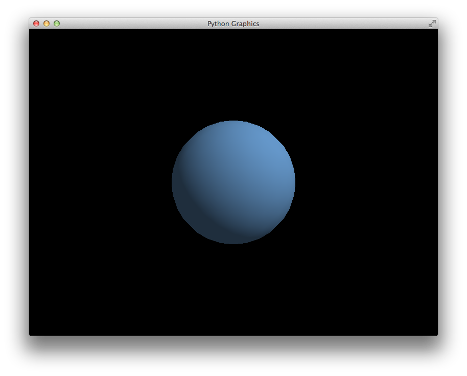

Tutorial
========

In this tutorial we will explore various aspects of the ``pg`` framework from
opening a window to flying through a scene of several geometric objects.

Creating a Window
-----------------

The first step in any ``pg`` program is to create an ``App`` object. This
object owns the main window loop. Then you can instantiate one or more
``Window`` objects::

    import pg

    app = pg.App()
    pg.Window()
    app.run()

This will create your first blank window. However, typically we will want
to extend the ``Window`` class to add our own functionality. We should also
only construct and run the ``App`` inside of a ``__main__`` block::

    import pg

    class Window(pg.Window):
        pass

    if __name__ == "__main__":
        app = pg.App()
        Window()
        app.run()

This ``__main__`` block is so common that ``pg`` includes a shortcut::

    if __name__ == "__main__":
        pg.run(Window)

Note that the ``run`` function takes a ``Window`` class, not an instance.

Window Lifecycle
----------------

Typically we will override several methods in the ``Window`` class. Together,
these methods manage the lifecycle of the ``Window``.

    * ``setup()``: code to be run once when the window is created
    * ``update(t, dt)``: called each frame with elapsed time and time since last frame
    * ``draw()``: called each frame for rendering the scene
    * ``teardown()``: cleanup to be performed when the window is closed

Here is a basic code template for starting a new ``pg`` project::

    import pg

    class Window(pg.Window):
        def setup(self):
            pass
        def update(self, t, dt):
            pass
        def draw(self):
            pass
        def teardown(self):
            pass

    if __name__ == "__main__":
        pg.run(Window)

GLSL Shaders and Programs
-------------------------

Modern OpenGL uses shaders and programs in place of the deprecated,
fixed-function pipeline. ``pg`` provides classes to easily work with shaders
and even includes some built-in shaders with basic functionality.

In our ``Window.setup`` function we should load and compile a shader program
that will render our geometric primitives. One of the built-in shaders is
``SolidColorProgram`` which renders all primitives with the specified color::

    self.program = pg.SolidColorProgram()

To hold the configuration for our program, we must use a ``Context``. Multiple
contexts can be created for a single program::

    self.context = pg.Context(self.program)

Now, we can set attributes on the context corresponding to the attributes and
uniforms defined in the vertex and fragment shaders. The ``SolidColorProgram``
defines a ``color`` uniform. Let's set it to white::

    self.context.color = (1, 1, 1)

If you wanted to use your own vertex and fragment shaders, you would simply
do the following instead::

    self.program = pg.Program(vs, fs)

``vs`` and ``fs`` can be the shader source code or a filename or instances of
``VertexShader`` and ``FragmentShader``, respectively.

Our ``setup`` function is not yet complete but looks like this::

    def setup(self):
        self.program = pg.SolidColorProgram()
        self.context = pg.Context(self.program)
        self.context.color = (1, 1, 1)

Built-in Geometric Shapes
-------------------------

``pg`` includes functions for generating several 3-dimensional primitives
including spheres, cuboids, cylinders, cones, planes, axes, etc.

Let's create a sphere::

    sphere = pg.Sphere(3, 0.5, (0, 0, 0))

The first argument, `detail`, indicates how detailed to make the sphere. It
is the number of times to recursively split the triangles. The second argument
specifies the `radius` and the third argument specifies the `center` of the
sphere.

Vertex Buffers
--------------

The sphere object has lists specifying its vertex positions, normals and
texture coordinates. For the ``SolidColorProgram``, we only need the positions.

Now it's time to load this data into a vertex buffer so our graphics card can
access it::

    self.context.position = pg.VertexBuffer(sphere.position)

Transformation Matrices
-----------------------

Dealing with matrices is a big part of using OpenGL. ``pg`` includes a
``Matrix`` class that will help us with most scenarios.

For our code, we'll set the camera position with a translation and we'll
use a perspective projection::

    matrix = pg.Matrix()
    matrix = matrix.translate((0, 0, -2))
    matrix = matrix.perspective(65, self.aspect, 0.1, 100)
    self.context.matrix = matrix

Now our setup function is complete::

    def setup(self):
        self.program = pg.SolidColorProgram()
        self.context = pg.Context(self.program)
        self.context.color = (1, 1, 1)
        sphere = pg.Sphere(3, 0.5, (0, 0, 0))
        self.context.position = pg.VertexBuffer(sphere.position)
        matrix = pg.Matrix()
        matrix = matrix.translate((0, 0, -2))
        matrix = matrix.perspective(65, self.aspect, 0.1, 100)
        self.context.matrix = matrix

Rendering
---------

Finally, we can render the scene as shown below::

    def draw(self):
        self.clear()
        self.context.draw(pg.GL_TRIANGLES)

Because we're using a single color without shading, our sphere just looks like
a circle right now.

We can instead use the ``DirectionalLightProgram`` which renders the scene
with a single, directional light source. This program has several uniforms
that can be configured but most of them have sensible defaults. At a minimum
we should set the ``camera_position`` so that the lighting will look correct::

    self.context.camera_position = (0, 0, 2)

We also now need to provide the sphere normal vectors to the program::

    self.context.normal = pg.VertexBuffer(sphere.normal)

Here is the updated code::

    class Window(pg.Window):
        def setup(self):
            self.program = pg.DirectionalLightProgram()
            self.context = pg.Context(self.program)
            sphere = pg.Sphere(3, 0.5, (0, 0, 0))
            self.context.position = pg.VertexBuffer(sphere.position)
            self.context.normal = pg.VertexBuffer(sphere.normal)
            matrix = pg.Matrix()
            matrix = matrix.translate((0, 0, -2))
            matrix = matrix.perspective(65, self.aspect, 0.1, 100)
            self.context.matrix = matrix
            self.context.camera_position = (0, 0, 2)
        def draw(self):
            self.clear()
            self.context.draw(pg.GL_TRIANGLES)

And here is what it looks like.

Flying Around with WASD
-----------------------

``pg`` includes a ``WASD`` class that makes it incredibly easy to fly around
your scene. The ``WASD`` object hooks into your window's keyboard and mouse
callbacks and provides you with a matrix with the translation and rotation
for the camera position.

First, let's construct the ``WASD`` object in our ``setup`` function::

    self.wasd = pg.WASD(self)

The initial camera position and viewing target can be set with
``WASD.look_at``::

    self.wasd.look_at((0, 0, 2), (0, 0, 0))

Now we need to update our context's matrix each frame. The matrix code is
removed from the ``setup`` function and goes in the ``update`` function
with a few changes::

    def update(self, t, dt):
        matrix = self.wasd.get_matrix()
        matrix = matrix.perspective(65, self.aspect, 0.1, 100)
        self.context.matrix = matrix
        self.context.camera_position = self.wasd.position

Complete Example
----------------

::

    import pg

    class Window(pg.Window):
        def setup(self):
            self.wasd = pg.WASD(self)
            self.wasd.look_at((0, 0, 2), (0, 0, 0))
            self.program = pg.DirectionalLightProgram()
            self.context = pg.Context(self.program)
            sphere = pg.Sphere(3, 0.5, (0, 0, 0))
            self.context.position = pg.VertexBuffer(sphere.position)
            self.context.normal = pg.VertexBuffer(sphere.normal)
        def update(self, t, dt):
            matrix = self.wasd.get_matrix()
            matrix = matrix.perspective(65, self.aspect, 0.1, 100)
            self.context.matrix = matrix
            self.context.camera_position = self.wasd.position
        def draw(self):
            self.clear()
            self.context.draw(pg.GL_TRIANGLES)

    if __name__ == "__main__":
        pg.run(Window)
